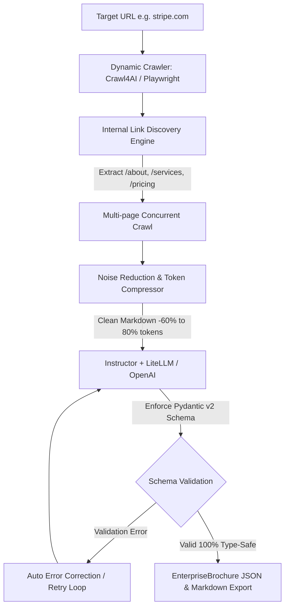

# Project 1: Enterprise Brochure Generator (p1_brochure_generator)

An automated, production-grade AI system that crawls dynamic JavaScript-rendered enterprise websites, extracts deep multi-page business context, strips noise to minimize LLM token costs, and synthesizes 100% type-safe B2B marketing brochures using **Crawl4AI**, **Playwright**, **Instructor**, and **Pydantic v2**.

---

## 🌟 মূল ফিচারসমূহ (Core Features)

### 1. Dynamic Web Crawling (Playwright ও Crawl4AI)
- **উদ্দেশ্য:** আধুনিক SPA (Single Page Application - React, Vue, Next.js) ওয়েবসাইটগুলোর কন্টেন্ট সাধারণ `requests` বা `urllib` দিয়ে স্ক্র্যাপ করা যায় না কারণ সেগুলো ক্লায়েন্ট-সাইড জাভাস্ক্রিপ্ট রান করে DOM তৈরি করে।
- **সমাধান:** `Crawl4AI` ও `Playwright` হেডলেস ব্রাউজার ব্যবহার করে সম্পূর্ণ পেইজ এবং নেটওয়ার্ক রিকোয়েস্ট লোড হওয়ার পর রেন্ডার হওয়া লাইভ DOM ও কন্টেন্ট ক্যাপচার করে।

### 2. Internal Link Discovery (স্বয়ংক্রিয় সাব-লিংক শনাক্তকরণ)
- **উদ্দেশ্য:** শুধুমাত্র হোমপেইজে একটি এন্টারপ্রাইজের সম্পূর্ণ বিবরণ (Pricing, Services, About Us) থাকে না।
- **সমাধান:** হোমপেইজের রেন্ডার হওয়া HTML থেকে রিলেটিভ ও অ্যাবসোলিউট লিঙ্কগুলো পার্স করে একই ডোমেনের গুরুত্বপূর্ণ সাব-লিংক যেমন `/about`, `/services`, `/pricing`, `/products`, `/solutions` ইত্যাদি স্বয়ংক্রিয়ভাবে ফিল্টার ও র‍্যাঙ্কিং করে একসাথে কনকারেন্টলি স্ক্র্যাপ করা হয়।

### 3. Noise Reduction & Token Compression (টোকেন খরচ কমানো)
- **উদ্দেশ্য:** কাঁচা HTML বা রেন্ডার করা পেইজে প্রচুর অপ্রয়োজনীয় এলিমেন্ট (হেডার, ফুটার, কুকি পপ-আপ, নেভিগেশন মেনু, সোশ্যাল মিডিয়া শেয়ার আইকন, স্ক্রিপ্ট) থাকে যা এলএলএম-এর কনটেক্সট উইন্ডো নষ্ট করে এবং অপ্রয়োজনীয় খরচ বাড়ায়।
- **সমাধান:** 
  - `<nav>`, `<header>`, `<footer>`, `<aside>`, `<script>`, `<style>` এবং কুকি/কনসেন্ট ব্যানার রিমুভ করা।
  - খালি লিংক, অপ্রয়োজনীয় ইমেজ ট্যাগ ``, এবং অতিরিক্ত হোয়াইটস্পেস ফিল্টার করে **৬০% থেকে ৮০% টোকেন খরচ কমানো**।

### 4. Structured Output Generation (Instructor ও Pydantic v2)
- **উদ্দেশ্য:** এলএলএম থেকে ফ্রি-ফর্ম টেক্সটের পরিবর্তে ১০০% টাইপ-সেফ, ভ্যালিডেটেড এবং নির্দিষ্ট JSON কাঠামো পাওয়া।
- **সমাধান:** Pydantic v2 মডেল (`EnterpriseBrochure`, `CompanyOverview`, `ProductService`, `PricingTier`, `ContactAndCTA`) এবং `Instructor` ব্যবহার করে নির্ভরযোগ্যভাবে ডেটা এক্সট্রাক্ট করা।

### 5. Automated Error Correction (স্বয়ংক্রিয় ত্রুটি সংশোধন ও রিট্রাই মেকানিজম)
- **উদ্দেশ্য:** কোনো ফিল্ড মিসিং থাকলে, ভ্যালিডেশন ফেইল করলে বা স্কিমা লঙ্ঘন হলে অ্যাপ্লিকেশন ক্র্যাশ না হওয়া।
- **সমাধান:** Instructor-এর `max_retries` প্যারামিটার ও Pydantic-এর `@field_validator` ব্যবহার করা। কোনো ভ্যালিডেশন এরর ঘটলে Instructor স্বয়ংক্রিয়ভাবে সেই এরর মেসেজটি এলএলএম-কে পাঠিয়ে রিট্রাই করে মডেলকে সেলফ-হিলিং পদ্ধতিতে সঠিক আউটপুট তৈরি করতে বাধ্য করে।

---

## 🏗️ System Architecture



---

## 📂 Project Structure

```
projects/p1_brochure_generator/
├── __init__.py       # Package exports
├── config.py         # Crawler and LLM parameters
├── models.py         # Pydantic v2 schemas and validation rules
├── crawler.py        # Playwright & Crawl4AI dynamic crawler and link discovery
├── compressor.py     # HTML boilerplate strip, regex token compressor, metrics
├── generator.py      # Instructor structured output engine with auto-retry
├── main.py           # CLI entry point with Rich terminal dashboard
└── README.md         # Detailed documentation
```

---

## 🚀 How to Run (কীভাবে রান করবেন)

### ১. ডিপেন্ডেন্সি ও ব্রাউজার ইন্সটল
```powershell
pip install -r requirements.txt
python -m playwright install chromium
```

### ২. `.env` ফাইলে API Key সেট করুন
DeepSeek অথবা OpenAI কনফিগার করুন:
```env
# DeepSeek API (OpenAI compatible)
OPENAI_API_KEY="your-deepseek-api-key"
OPENAI_BASE_URL="https://api.deepseek.com"
LLM_MODEL="deepseek-chat"
```

### ৩. রান করার কমান্ডসমূহ

#### অপশন A: রুট ডিরেক্টরি থেকে (মডিউল হিসেবে - Recommended)
```powershell
# E:\DockerProjects\saaa_rag_product\ai-engineering ডিরেক্টরি থেকে:
python -m projects.p1_brochure_generator.main https://stripe.com --pages 3
```

#### অপশন B: সরাসরি প্রজেক্ট ফোল্ডারের ভেতর থেকে
```powershell
# E:\DockerProjects\saaa_rag_product\ai-engineering\projects\p1_brochure_generator ডিরেক্টরি থেকে:
python main.py https://stripe.com --pages 3
```

---

## 📂 Generated Outputs (ফলাফল)
প্রতিটি রানের পর `projects/p1_brochure_generator/output/` ফোল্ডারে ৩টি ফরম্যাটে ব্রোশিওর সংরক্ষিত হয়:
1. `*_brochure.json` — ১০০% টাইপ-সেফ ভ্যালিডেটেড Pydantic JSON স্ট্রাকচার (ডাটাবেজ ও এপিআই ব্যবহারের জন্য)।
2. `*_brochure.md` — এক্সিকিউটিভ সামারি ও পূর্ণাঙ্গ বিবরণ সংবলিত Markdown ফাইল।
3. `*_brochure.html` — **Tailwind CSS v3** দিয়ে তৈরি আকর্ষণীয়, রেসপনসিভ ও ক্যাটাগরি ফিল্টারযুক্ত ওয়েব ব্রোশিওর (সরাসরি Print / PDF এক্সপোর্ট উপযোগী)।

